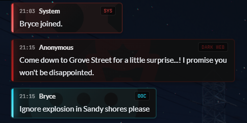

# 💬 Modern Chat Theme

A simple, aesthetic theme for FiveM's chat with several built-in commands designed for RP.

## 📃 Features
- A sleek, new design to chat messages, the input, suggestions, and the overall design of FiveM's chat
- Discord logging & role integration
- 10 ready-to-go commands for your RP experience:
    - `/ooc` & `/looc` - out-of-character
    - `/me` & `/gme` - in-character 
    - `/do` - environments
    - `/ad` - advertisements
    - `/li` - LifeInvader
    - `/dw` - dark web
    - `/dm` & `/r` - DMs and replies

## 🛠️ Installation
1. Download the source code from GitHub (Green code button -> download ZIP)
2. Extract the contents of the archive to your server's resources folder
3. Ensure the resource
4. That's it!

*Additional configuration instructions can be found in `config.lua`.*

Note: *This resource depends on FiveM's default `chat` resource. Please ensure that your server is using it.*

## 🖐️ Permissions
You are 100% welcome to modify this code to fit your server's needs. For a further list of permissions, see the `LICENSE`.

